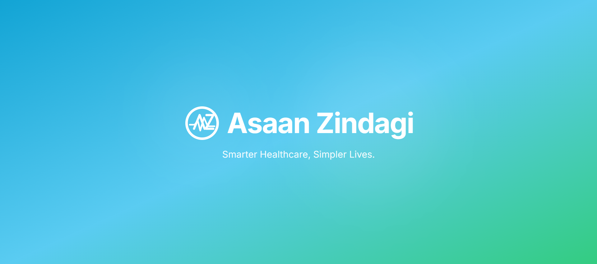

# 🏥 Asaan Zindagi — Smart Healthcare Queue & Appointment Optimization System

> **Final Year Project | BS Computer Engineering**
> National University of Computer & Emerging Sciences (FAST-NUCES), Karachi — June 2026

**Asaan Zindagi** is a cloud-native, serverless OPD (Out-Patient Department) management system designed to eliminate inefficiencies in traditional healthcare queue management. The system achieves a **25–30% reduction in patient wait times** through a Dynamic FCFS Re-indexing Algorithm and real-time multi-portal synchronization.



---

## 👥 Authors

| Name | Roll No |
|---|---|
| Amir Abbasi | 22K-4923 |
| Syed Ammar Zulfiqar | 22K-4845 |

**Internal Advisor:** Engr. Qurat ul Ain Sohail

---

## 📌 Table of Contents

- [Problem Statement](#problem-statement)
- [Key Features](#key-features)
- [System Architecture](#system-architecture)
- [Tech Stack](#tech-stack)
- [Modules](#modules)
- [Algorithm](#algorithm)
- [Results](#results)
- [SDG Alignment](#sdg-alignment)
- [Limitations](#limitations)
- [Installation & Setup](#installation--setup)

---

## ❗ Problem Statement

Patients in conventional OPD settings spend significantly more time waiting than in actual medical consultation, creating:
- Operational bottlenecks for clinic staff
- Psychological stress for both patients and healthcare providers
- Communication gaps between patients, doctors, and administrators

Asaan Zindagi directly addresses these issues through intelligent scheduling, real-time synchronization, and automated notifications — all without requiring dedicated hardware infrastructure.

---

## ✨ Key Features

- **Dynamic FCFS Re-indexing** — Enhances the conventional First-Come-First-Served model to handle real-world patient tardiness and cancellations using stack-like re-indexing at the database trigger level
- **Real-Time Multi-Portal Sync** — All three portals (Patient, Doctor, Admin) stay synchronized within milliseconds via Supabase Realtime WebSocket subscriptions
- **Trigger-Driven Notification Engine** — Fully automated PL/pgSQL notification pipeline for booking, approval, cancellation, and clinical remark events — no application-layer polling needed
- **Pinned Emergency Medical Summary** — Patients can pin critical diagnostic documents that are immediately surfaced in the doctor's consultation interface
- **Wait-Time Prediction** — Heuristic prediction model providing accurate real-time wait-time estimates
- **Double Booking Prevention** — Database-level constraints preventing overlapping appointment slots
- **Role-Based Access Control (RBAC)** — Row-Level Security (RLS) policies enforced at the PostgreSQL layer across all three user roles
- **Zero-Cost Deployment** — Entire production pipeline built on free-tier services (Supabase + Vercel + GitHub Actions)

---

## 🏗️ System Architecture

The system follows a **Three-Tier Serverless Architecture**:

```
┌─────────────────────────────────────────────┐
│           React.js + Vite Frontend           │
│   Patient Portal | Doctor Dashboard | Admin  │
└──────────────────────┬──────────────────────┘
                       │ REST + WebSocket
┌──────────────────────▼──────────────────────┐
│              Supabase Backend                │
│  PostgreSQL + PL/pgSQL Triggers + RLS + Auth │
└──────────────────────┬──────────────────────┘
                       │
┌──────────────────────▼──────────────────────┐
│          Railway Cloud Deployment            │
│           CI/CD via GitHub Actions           │
└─────────────────────────────────────────────┘
```

---

## 🛠️ Tech Stack

| Layer | Technology |
|---|---|
| Frontend | React.js, Vite, TypeScript |
| Backend / Database | Supabase (PostgreSQL) |
| Queue Logic | PL/pgSQL Triggers, Dynamic FCFS Re-indexing |
| Real-Time | Supabase Realtime (WebSocket) |
| Authentication | Supabase Auth (JWT + Role Resolution) |
| Deployment | Railway Cloud |
| CI/CD | GitHub Actions |
| Storage | Supabase Storage (Medical Documents) |

---

## 📦 Modules

### 🧑‍💼 Patient Portal
- Specialist discovery and real-time slot selection
- Appointment booking and status tracking
- Personal medical document vault with emergency pinning
- Live wait-time prediction display
- Real-time notifications for booking confirmations and updates

### 🩺 Doctor Dashboard
- Live queue view with dynamic re-indexed patient order
- Mark consultation as complete / trigger re-indexing
- Access to patient medical history and pinned emergency summary
- Real-time appointment status transitions

### 🔧 Admin Panel
- Full appointment lifecycle management (approve / cancel / reschedule)
- Colour-coded activity feed and audit trail
- Doctor and time-slot management
- System-wide notification oversight

---

## ⚙️ Algorithm

### Dynamic Priority-Shifting Algorithm (FCFS + Re-indexing)

The core queue engine is implemented as a **PostgreSQL trigger function** that fires on every appointment status change:

1. When a patient is marked `completed` or `cancelled`, the trigger fires
2. All remaining patients in the session are re-indexed using **stack-like positional shifting**
3. Late arrivals are re-inserted at the back of the active queue rather than dropped
4. The updated queue order is broadcast via Supabase Realtime to all connected portals within milliseconds

This eliminates the "ghost slot" problem in static FCFS systems and maintains maximum clinic throughput despite real-world arrival irregularities.

---

## 📊 Results

| Metric | Result |
|---|---|
| Wait Time Reduction | 25–30% vs static FCFS baseline |
| Wait-Time Prediction Accuracy | High (validated over 8-appointment sessions) |
| Real-Time Sync Latency | < milliseconds (WebSocket) |
| Plagiarism Score (Turnitin) | 4% similarity index |
| Deployment Platform | Railway Cloud (Free Tier) |

**Key validated outcomes:**
- Dynamic re-indexing consistently outperforms static FCFS in session throughput
- Predicted vs actual wait times show strong alignment in simulated sessions
- All RBAC and RLS security controls passed validation testing
- Zero additional hardware cost compared to IoT-based alternatives

---

## 🌍 SDG Alignment

This project directly contributes to:

**🎯 UN Sustainable Development Goal 3 — Good Health and Well-Being**

By improving efficiency and accessibility of digital health services in outpatient settings, Asaan Zindagi demonstrates that production-grade healthcare infrastructure can be deployed at zero capital cost — making it directly replicable for small and mid-sized clinics across Pakistan and similar developing-world contexts.

---

## ⚠️ Limitations

- **Web-only** — No native mobile application in the current version
- **Cold-start latency** — Free-tier Railway deployment introduces ~30 seconds cold-start after inactivity
- **RLS hardening** — Final security audit pending before full adversarial hardening
- **Live dataset validation** — Dynamic re-indexing has been validated through functional testing; evaluation against a live patient dataset and high-concurrency stress testing remains as future work
- **Single-clinic scope** — Inpatient management, billing, pharmacy, and lab systems are outside the current scope

---

## 🚀 Installation & Setup

### Prerequisites
- Node.js (v18+)
- npm or yarn
- A Supabase account (free tier sufficient)

### Clone the Repository

```bash
git clone https://github.com/your-username/asaan-zindagi.git
cd asaan-zindagi
```

### Install Dependencies

```bash
npm install
```

### Configure Environment Variables

Create a `.env` file in the root directory:

```env
VITE_SUPABASE_URL=your_supabase_project_url
VITE_SUPABASE_ANON_KEY=your_supabase_anon_key
```

### Run Database Migrations

Apply the PL/pgSQL trigger migrations via the Supabase SQL Editor or CLI:

```bash
supabase db push
```

### Start Development Server

```bash
npm run dev
```

The app will be available at `http://localhost:5173`

### Production Deployment (Railway)

Push to `main` branch — GitHub Actions will handle the CI/CD pipeline automatically to Railway Cloud.

---

## 📄 License

This project was developed as an academic Final Year Project at FAST-NUCES, Karachi. All rights reserved by the authors.

---

*Asaan Zindagi — Making healthcare access easier, one queue at a time.*
